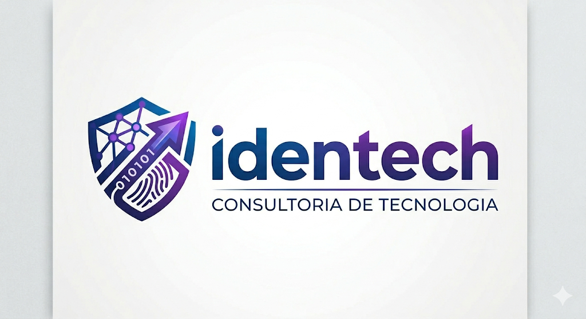

  

<h1 align="center">
  <b>Somos a</b> 
  
</h1>

  <strong>Transformando ideias em presença digital de alto impacto.</strong>

---

### 🚀 Sobre a Identech

  Já pensou em como um website pode viabilizar sua marca ou produto? 
  Somos um grupo de estudantes focado em desenvolver soluções web para marcas que desejam expandir seus negócios.

> **Nosso diferencial:** Criamos o seu projeto **do ZERO**, desde a prototipagem no Figma até o site hospedado e pronto para o uso.

---

### 🛠️ Nossa Stack Tecnológica

*Utilizamos as ferramentas mais modernas do mercado para entregar projetos rápidos, bonitos e responsivos.*

| Categoria | Tecnologias |
| :--- | :--- |
| **Design / UI** |   |
| **Frontend** |     |
| **Styling** |   |
| **Hosting** |   |

---

### 🤝 Como trabalhamos?
1.  🎨 **Prototipagem:** Design pensado na experiência do usuário (UX/UI).
2.  💻 **Desenvolvimento:** Código limpo, moderno e otimizado para SEO.
3.  🌐 **Hospedagem:** Seu site no ar para o mundo todo.
